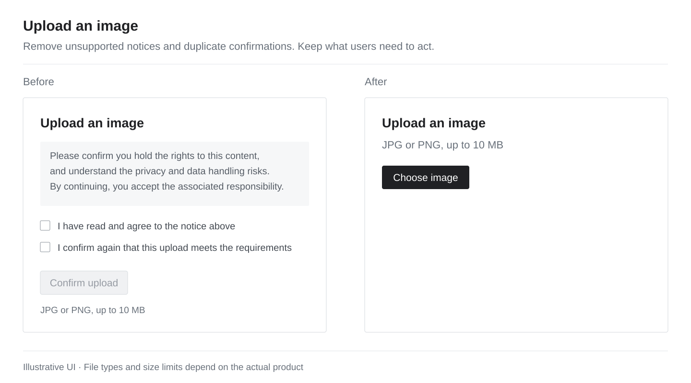

<p align="center">
  
</p>

<h1 align="center">Agent-No-bullshit</h1>

<p align="center"><a href="README.md">中文</a> · <strong>English</strong></p>

<p align="center"><strong>Less chatter from your agent. Less clutter in your product.</strong></p>
<p align="center">A skill for Codex communication and product copy.</p>

<p align="center">
  <a href="#get-started-in-30-seconds">Quick install</a> ·
  <a href="SKILL.en.md">Read the rules</a> ·
  <a href="#see-the-difference">Before and after</a> ·
  <a href="https://github.com/Fangx-AI/Agent-No-bullshit/issues">Share a case</a>
</p>

---

## Less chatter. More product.

You ask for an upload button and get a copyright notice. You ask for a menu fix and get a plan, a risk list, and deployment advice.

**Users want to finish the task, not read the agent's running commentary.**

Agent-No-bullshit covers two things: what the agent says while building, and what the product says to its users. Every sentence should help someone act, understand, or decide.

<table>
<tr>
<td width="33%" valign="top">

### 01 / Get on with it

When the request is clear, proceed. Stop repeating plans and asking for the same confirmation. Progress updates should bring useful new facts.

</td>
<td width="33%" valign="top">

### 02 / Make copy useful

Buttons, hints, and errors should serve the current task. Leave out explanations with no concrete purpose in the interface.

</td>
<td width="33%" valign="top">

### 03 / Deliver the result

Say what is done, what was verified, and what remains. A simple task can end with a few sentences.

</td>
</tr>
</table>

## See the difference

<p align="center">
  
</p>

*Illustrative design. File type and size limits should match the actual product.*

| Scenario | Remove | Keep |
| :--- | :--- | :--- |
| Image upload | Unsupported blanket disclaimers and repeated confirmations | File types, size limits, and ways to recover from errors |
| Development updates | Repeated plans, vague assurances, and template risk lists | Actual results, verification, and real blockers |
| Action feedback | A status paragraph and result card announcing the same success | One result with a next step, plus necessary screen reader announcements |
| Permanent deletion | Vague statements about responsibility | “Delete these 12 records? This cannot be undone.” |
| AI tool interfaces | Disclaimers added out of habit | Information users actually need for the current use |

> **The test: will this sentence change what the user does or understands next?**

## Get started in 30 seconds

<details open>
<summary><strong>macOS / Linux</strong></summary>

```bash
git clone https://github.com/Fangx-AI/Agent-No-bullshit.git "${CODEX_HOME:-$HOME/.codex}/skills/agent-no-bullshit"
```

</details>

<details>
<summary><strong>Windows PowerShell</strong></summary>

```powershell
$skillRoot = if ($env:CODEX_HOME) { Join-Path $env:CODEX_HOME 'skills' } else { Join-Path $env:USERPROFILE '.codex\skills' }
New-Item -ItemType Directory -Force -Path $skillRoot | Out-Null
git clone https://github.com/Fangx-AI/Agent-No-bullshit.git (Join-Path $skillRoot 'agent-no-bullshit')
```

</details>

Then ask Codex:

```text
Use $agent-no-bullshit to build an image compression tool.
```

To update an existing installation, run `git pull --ff-only` in the repository directory. The skill keeps the default automatic discovery setting; calling it explicitly makes your preference clear for the task.

Both language versions use the same installation. Read the complete [English rules](SKILL.en.md) here.

## Use it in real work

**Build a product**

```text
Use $agent-no-bullshit to build a to-do app.
Proceed directly. Keep only the interface copy people need to complete the task.
```

**Clean up an existing interface**

```text
Use $agent-no-bullshit to review this page's copy and confirmation steps.
Remove content with no practical purpose and keep necessary action information.
```

**Fix and verify**

```text
Use $agent-no-bullshit to fix the mobile menu and verify the result.
```

## Concise and accurate.

Read the [Round 3 evaluation in English](evaluations/2026-10-03-round3/REPORT.en.md). It used ordinary product requests and made deduplication concrete by reusing the action result area. It also added explicit wording for undo deadlines and demo-only submissions. The report retains failed samples, revisions, and browser tests; it does not establish a general improvement across all tasks. Original test samples and the earlier [Round 1](evaluations/2026-10-03/REPORT.md) and [Round 2](evaluations/2026-10-03-round2/REPORT.md) reports remain in Chinese.

Complex questions can still get a full explanation. State concrete consequences, real errors, and incomplete verification clearly. Understand the purpose of existing agreements and required notices before deciding whether to change them.

This skill changes communication and design choices. It does not rewrite global configuration or override higher-priority Codex instructions.

<details>
<summary><strong>What's in the repository?</strong></summary>

```text
agent-no-bullshit/
├── SKILL.md             # Active skill instructions
├── SKILL.en.md          # English version of the instructions
├── agents/openai.yaml   # Display name and invocation hint
├── assets/              # README visuals
├── README.md            # Chinese README
└── README.en.md         # This page
```

</details>

## Make it better with real cases.

Open an [Issue](https://github.com/Fangx-AI/Agent-No-bullshit/issues) or PR with the original request, the unnecessary copy, and the result you wanted. Remove private information first. Fix real problems without adding a page of rules for a single example.

---

<p align="center"><strong>Less talk. More shipped.</strong><br><sub>Every sentence should earn its place.</sub></p>
