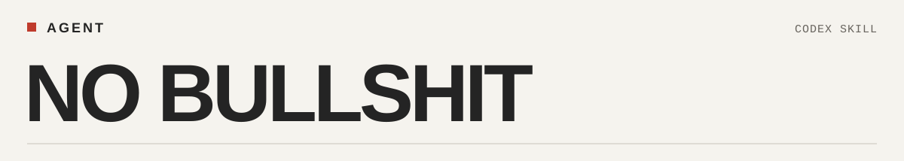

<picture>
  <source media="(prefers-color-scheme: dark)" srcset="assets/wordmark-dark.svg">
  
</picture>

**中文** · [English](README.en.md)

用于 Codex 产品开发：减少重复汇报、无依据的说明和多余确认。

<a id="看得见的变化"></a>

## 删除反馈

第三轮测试中，同一次删除在旧页面被提示了两遍。

| 旧规则生成的页面 | 修订规则生成的页面 |
| :--- | :--- |
| 已删除 2 项，可在 30 秒内撤销。<br><br>已删除 2 项资料<br>30 秒内可撤销<br>撤销删除 | 已删除 2 条资料<br>剩余 30 秒<br>撤销删除 |

删除前的“30 秒内可撤销，超时无法恢复”两版都保留。这里展示的是一个局部改动。

[原页面源码](evaluations/2026-10-03-round3/current/task-c.html) · [修订页面源码](evaluations/2026-10-03-round3/feedback-one/task-c.html) · [测试记录](evaluations/2026-10-03-round3/REPORT.md)

<a id="30-秒开始"></a>

## 安装

macOS / Linux：

```bash
git clone https://github.com/Fangx-AI/Agent-No-bullshit.git "${CODEX_HOME:-$HOME/.codex}/skills/agent-no-bullshit"
```

<details>
<summary>Windows PowerShell</summary>

```powershell
$skillRoot = if ($env:CODEX_HOME) { Join-Path $env:CODEX_HOME 'skills' } else { Join-Path $env:USERPROFILE '.codex\skills' }
New-Item -ItemType Directory -Force -Path $skillRoot | Out-Null
git clone https://github.com/Fangx-AI/Agent-No-bullshit.git (Join-Path $skillRoot 'agent-no-bullshit')
```

</details>

在 Codex 中调用：

```text
使用 $agent-no-bullshit，帮我做一个图片压缩工具。
```

更新：在安装目录运行 `git pull --ff-only`。

[完整规则](SKILL.md) · [提交案例](https://github.com/Fangx-AI/Agent-No-bullshit/issues)
