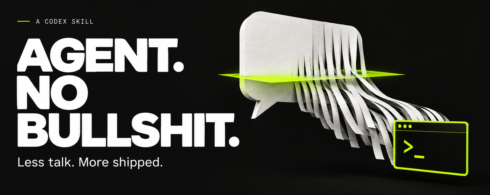
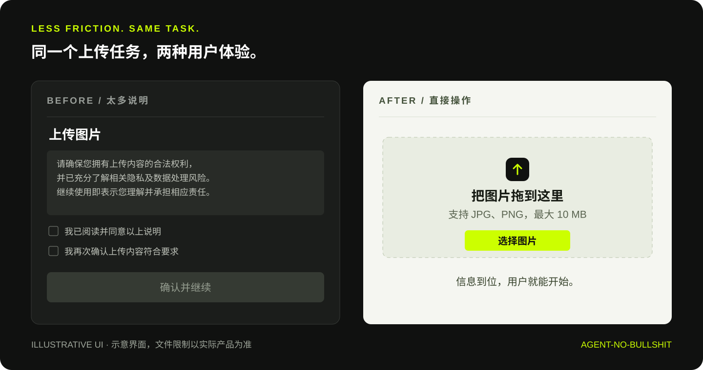

<p align="center">
  
</p>

<h1 align="center">Agent-No-bullshit</h1>

<p align="center"><strong>让 Agent 少说废话，让产品少一点多余。</strong></p>
<p align="center">一个约束 Codex 沟通方式与产品文案的 Skill。</p>

<p align="center">
  <a href="#30-秒开始">快速安装</a> ·
  <a href="SKILL.md">阅读规则</a> ·
  <a href="#看得见的变化">效果对比</a> ·
  <a href="https://github.com/Fangx-AI/Agent-No-bullshit/issues">提交案例</a>
</p>

---

## 少一点废话，多一点产品。

你要一个上传按钮，它给你一段版权声明。你要修一个菜单，它先讲计划，再讲风险，最后讲上线注意事项。

**用户想完成任务，不想阅读 Agent 的心理活动。**

Agent-No-bullshit 同时管两件事：开发时怎么说，产品里写什么。让每句话服务于操作、理解或决策。

<table>
<tr>
<td width="33%" valign="top">

### 01 / 直接做

需求明确就推进。少重复计划，少反复确认。进度只讲有用的新事实。

</td>
<td width="33%" valign="top">

### 02 / 写有用的

按钮、提示和错误信息服务于当前任务。没有具体用途的说明，不往界面里塞。

</td>
<td width="33%" valign="top">

### 03 / 交付结果

说清完成了什么、验证了什么、还缺什么。简单任务，几句话结束。

</td>
</tr>
</table>

## 看得见的变化

<p align="center">
  
</p>

*示意设计，用于展示判断方式；格式与大小限制应以真实产品为准。*

| 场景 | 删掉什么 | 留下什么 |
| :--- | :--- | :--- |
| 图片上传 | 无具体依据的免责长文、重复确认 | 格式、大小、失败后的处理办法 |
| 开发汇报 | 重复计划、空泛表态、模板式风险清单 | 实际结果、验证情况、真实阻塞 |
| 操作反馈 | 状态段与结果卡重复播报同一次成功 | 一处结果与下一步，保留必要读屏播报 |
| 不可恢复的删除 | 泛泛的责任说明 | “删除这 12 条记录？删除后无法恢复。” |
| AI 工具界面 | 习惯性堆叠的免责声明 | 当前用途确实需要用户知道的信息 |

> **判断标准：这句话，会改变用户下一步的行动或理解吗？**

## 30 秒开始

<details open>
<summary><strong>macOS / Linux</strong></summary>

```bash
git clone https://github.com/Fangx-AI/Agent-No-bullshit.git "${CODEX_HOME:-$HOME/.codex}/skills/agent-no-bullshit"
```

</details>

<details>
<summary><strong>Windows PowerShell</strong></summary>

```powershell
$skillRoot = if ($env:CODEX_HOME) { Join-Path $env:CODEX_HOME 'skills' } else { Join-Path $env:USERPROFILE '.codex\skills' }
New-Item -ItemType Directory -Force -Path $skillRoot | Out-Null
git clone https://github.com/Fangx-AI/Agent-No-bullshit.git (Join-Path $skillRoot 'agent-no-bullshit')
```

</details>

然后，在 Codex 里说：

```text
使用 $agent-no-bullshit，帮我做一个图片压缩工具。
```

已安装的用户在仓库目录运行 `git pull --ff-only` 更新。Skill 保留默认自动发现设置，显式调用能清楚表达本次偏好。

## 把它用在真实工作里

**做产品**

```text
使用 $agent-no-bullshit，做一个待办应用。
直接推进，界面只保留完成任务需要的信息。
```

**清理已有界面**

```text
使用 $agent-no-bullshit，检查这个页面的文案和确认步骤。
删除没有实际用途的内容，保留必要的操作信息。
```

**修问题并交付**

```text
使用 $agent-no-bullshit，修复移动端菜单并验证结果。
```

## 简洁，也要准确。

[查看三轮实际评估](evaluations/2026-10-03-round3/REPORT.md)：第三轮用普通产品需求测试，把去重落实为复用操作结果区，同时补上到期与演示后果的明确表达。报告保留失败样本、修订过程和浏览器实测。

复杂问题可以讲透。具体操作后果、真实错误和未完成的验证都要说清。已有协议和必要告知，应先弄清用途再决定是否修改。

这份 Skill 调整表达与设计取舍，不改写全局配置，也不覆盖 Codex 的更高优先级指令。

<details>
<summary><strong>仓库里有什么？</strong></summary>

```text
agent-no-bullshit/
├── SKILL.md             # 执行规则
├── agents/openai.yaml   # 显示名称与调用提示
├── assets/              # 首页视觉素材
└── README.md            # 你正在读的这一页
```

</details>

## 用案例，让它变好。

欢迎提交 [Issue](https://github.com/Fangx-AI/Agent-No-bullshit/issues) 或 PR：附上原始请求、多余文案和你期望的结果，移除私密信息即可。优先修正真实问题，不为了一个例子堆一页规则。

---

<p align="center"><strong>Less talk. More shipped.</strong><br><sub>每句话都该有用。</sub></p>
